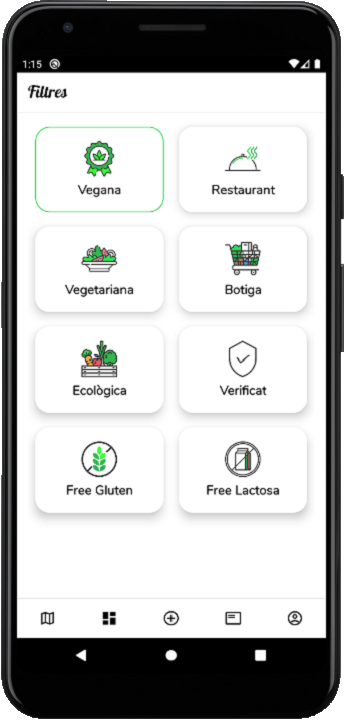

# HealthSites
Kotlin Android App



<iframe src="http://healthsites.herokuapp.com/" width="800" height="600"></iframe>
## Requirements

* Android Studio
* Firebase account (Firebase firestore database)
* Git

## Common setup

Clone the repo and install the dependencies.

```bash
git clone https://github.com/albeertito7/HealthSites.git
```

<b>Enjoy exploring the app and feel free to leave <a href="https://github.com/albeertito7/HealthSites/issues/new">feedback</a>.</b>
